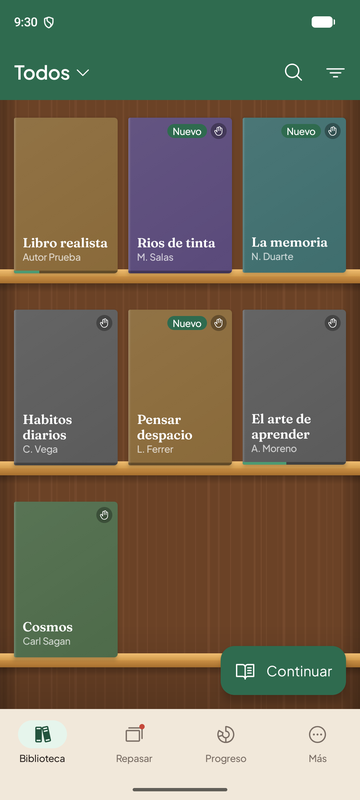
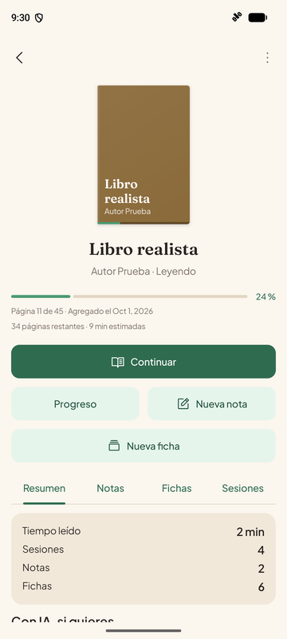
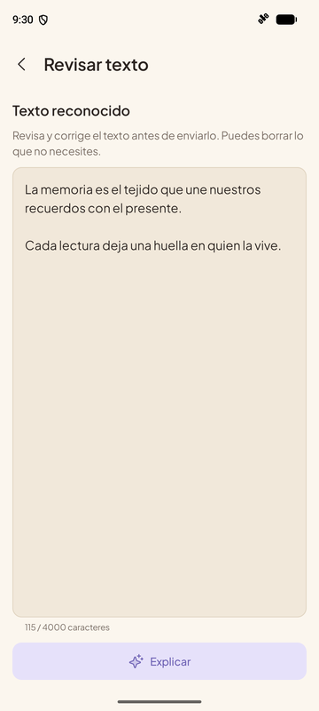
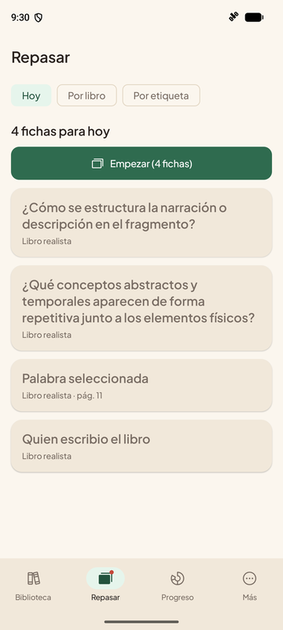
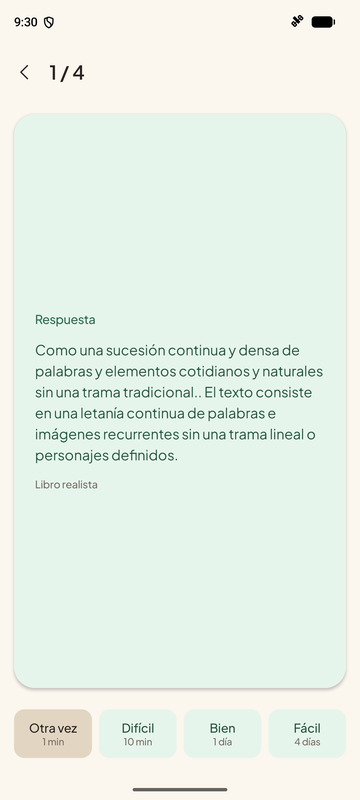

<div align="center">


# Reader

**Read. Understand. Remember.**

An Android reading companion that explains the hard parts with AI<br/>
and makes sure you don't forget what you read.


-8E75B2?logo=googlegemini&logoColor=white)


</div>

---

## ✨ The idea

We read a lot, understand part of it and forget most of it within days. Reader closes that loop:

```
   📖 Read  ──▶  💡 Understand  ──▶  📝 Save  ──▶  🔁 Review  ──▶  ✅ Test yourself
      ▲                                                                   │
      └──────────────────── what you miss comes back as a card ◀──────────┘
```

> **Snap a page** of a paper book (or select text in an ebook) → the text is **recognized on your phone** → the AI **explains it in plain words** (Feynman method) → you **save it as a note** and turn the key ideas into **flashcards**.

## 📱 Screenshots

<div align="center">

| Library | Book | Capture + OCR | Review | Flashcard |
|:---:|:---:|:---:|:---:|:---:|
|  |  |  |  |  |

</div>

## 🚀 Features

### 📚 Library and reading
- **Shelves, grid or list** view, with collections, search, sorting and filters.
- **Ebooks** (EPUB and PDF) read inside the app: themes, fonts, table of contents, bookmarks and highlights.
- **Paper books** too: register them and track your page, progress and remaining time.
- **Watch a folder**: books you drop into it are imported automatically.

### 💡 Understand with AI
- **Select text** in an EPUB, **mark an area** of a PDF or **take a photo** of a paper page.
- On-device **OCR** (ML Kit) extracts the text, warns you when it isn't sure, and lets you fix it.
- The AI **explains it simply**, with everyday analogies.
- **"Ahora tú"**: write your own interpretation and get feedback on it.

### 📝 Notes
- **Written notes**, **AI explanations** and **voice notes** (with optional transcription), each one linked to its book and page.
- Search every note by text and filter by type.

### 🔁 Remember
- **Flashcards** from your notes, explanations, selected text or failed quiz questions. The AI can suggest the question and answer.
- **Spaced repetition** (simplified SM-2): each card comes back right before you would forget it.
- **Quizzes** on a chapter, a paragraph, your cards or your notes, and the questions you miss become new cards.

### 📈 Progress
- Daily reading goal, streak, weekly chart and finished books.
- Per-book summary: time read, sessions, notes and cards.

### 🔒 Your data stays yours
- **No accounts, no servers.** Everything lives on your phone.
- **Backup and restore** everything (books, notes, cards, voice notes) to a single ZIP file.

## 📦 Install

1. Download `Reader-0.1.0.apk` from the [**Releases**](https://github.com/Fabiann1809/reader/releases) page, or [build it yourself](#️-build-from-source).
2. Open it on your phone. Android will ask you to **allow installing apps from this source**: allow it.
3. Open **Reader**, add your first book and you're ready.

> Requires **Android 8.0 (API 26)** or newer.

## 🔑 Get your free AI key

Reader uses **Google Gemini** with your own API key (*bring your own key*). It's free and takes a minute:

1. Open [**aistudio.google.com/apikey**](https://aistudio.google.com/apikey).
2. Sign in with your Google account.
3. Tap **Create API key** and copy it.
4. In Reader, go to **Más → Configuración → Clave de IA**, paste it and tap **Guardar clave**. Use **Probar clave** to check it.

> 🔐 The key is stored **encrypted** on your phone (Android Keystore) and is only sent to Google when you ask for an explanation, a quiz or a transcription. It is never included in backups.

Everything else (library, reader, OCR, notes, reviews) works without a key.

## 🛠️ Build from source

**Requirements:** Android Studio (recent), JDK 17 or newer and the Android SDK (compile SDK 37).

```bash
git clone https://github.com/Fabiann1809/reader.git
cd reader
./gradlew assembleDebug        # app/build/outputs/apk/debug/app-debug.apk
./gradlew testDebugUnitTest    # unit tests
```

### Signed release APK

1. Create a keystore (keep it, and its password, somewhere safe and **out of the repo**):
   ```bash
   keytool -genkeypair -keystore ~/keystores/reader-release.jks -alias reader \
     -keyalg RSA -keysize 4096 -validity 10000
   ```
2. Create `keystore.properties` in the project root (it is git-ignored):
   ```properties
   storeFile=/absolute/path/to/reader-release.jks
   storePassword=your-password
   keyAlias=reader
   keyPassword=your-password
   ```
3. Build:
   ```bash
   ./gradlew assembleRelease      # app/build/outputs/apk/release/app-release.apk
   ```

Without `keystore.properties`, the release APK is built unsigned. Release builds are minified and shrunk with R8.

## 🧱 Tech stack

| Layer | Technology |
|---|---|
| Language & UI | Kotlin, Jetpack Compose, Material 3, Navigation Compose |
| Architecture | MVVM (ViewModel + `StateFlow`), repositories, manual DI (`AppContainer`) |
| Storage | Room, DataStore |
| Reader | Readium Kotlin Toolkit (EPUB, PDF via PDFium) |
| Camera & OCR | CameraX, ML Kit Text Recognition (on-device) |
| AI | Google Gemini over OkHttp + kotlinx.serialization, behind an `AiProvider` interface |
| Background work | WorkManager |

```
io.github.fabiann1809.reader
├── data/   Room entities, DAOs and repositories
├── ai/     AiProvider, Gemini implementation and prompts
├── ocr/    ML Kit text recognition wrapper
├── ui/     Compose screens and ViewModels, one package per feature
└── util/   small shared helpers
```

## 🗺️ Roadmap

- 🔊 Read aloud with sentence highlighting
- 📄 TXT and comic (CBZ) reading
- 🔎 Add paper books by scanning the ISBN
- 🔔 Daily review and reading reminders
- 🧩 Home screen widget and shortcuts
- ☁️ Optional sync with Google Drive or Dropbox

## 📄 License

[MIT](LICENSE) © 2026 Fabiann1809
